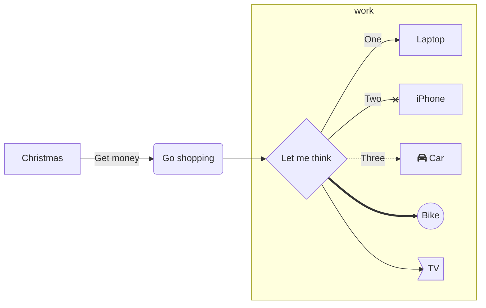
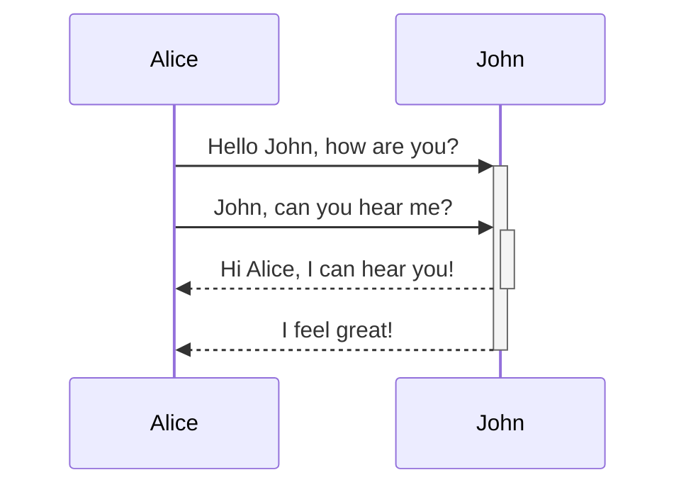
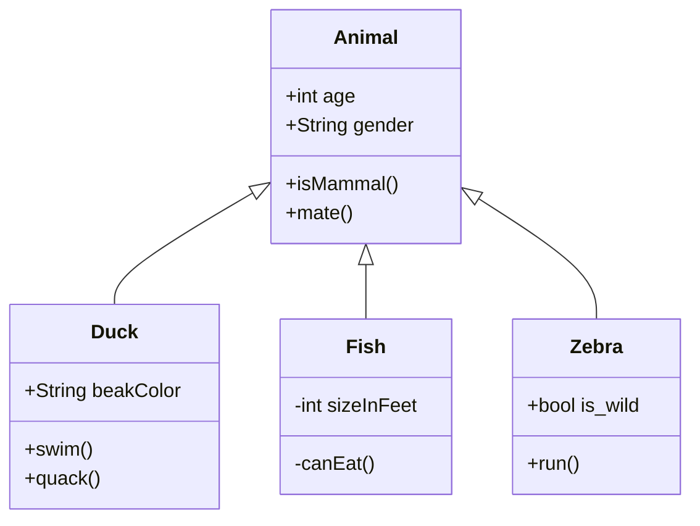
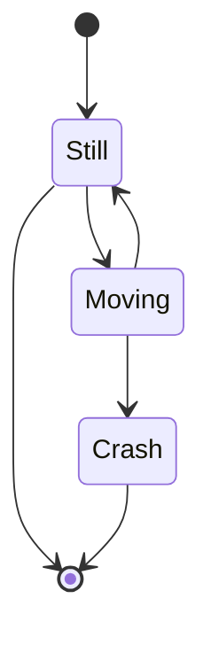
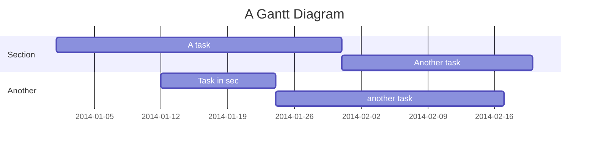
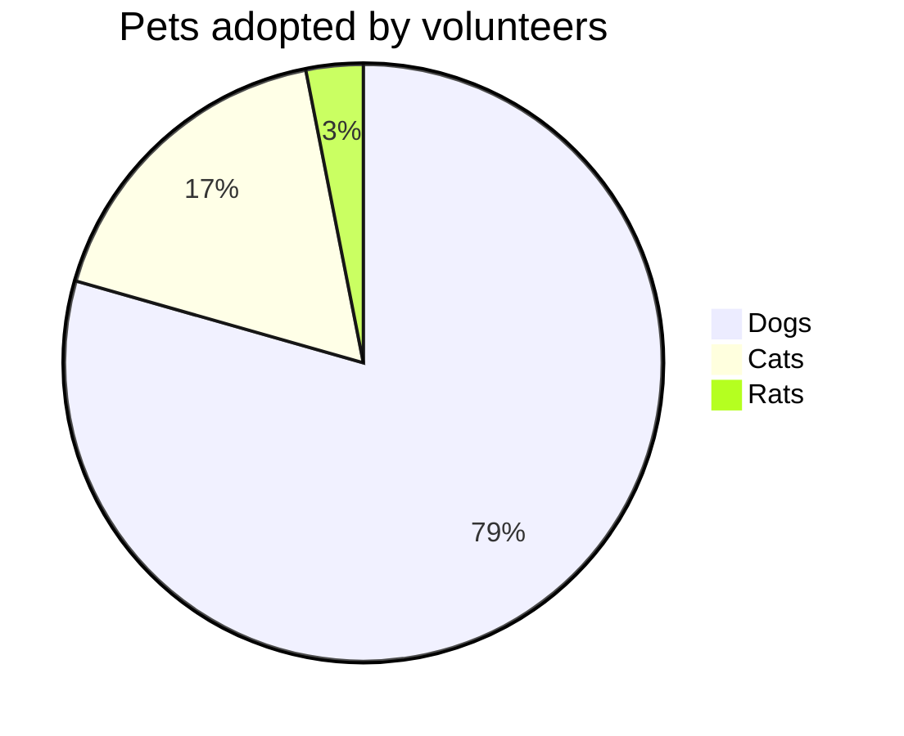

[TOC]

# High-level Markdown skills  

## TODO list

Future improvements:
- [ ] Point 1
- [ ] Point 2
- [x] Point 3

## Code diff

```diff
function compare (num1, num2) {
-  return ALL_SAME;
+  return NOT_SAME;
}
```

## Diagram
[Mermaid doc reference](https://mermaid-js.github.io/mermaid/#/flowchart)
### Flow Chart



### Sequence Diagram


### Class Diagram


### State Diagram


### Gantt


### Pie chart


## Image
Control image width and height   
    

Image align in the center
​​ <div align="center"></div>


## Fold 
<details>
<summary>Fold/Open</summary>
Folded content
</details>

## Math forumla
$\sum_{n=1}^{10} n^2$
$$\sum_{n=1}^{10} n^2$$

## Footnote
Here need a footnote[^noteID1]。

[^noteID1]: Here is the quote for **ID1**.
